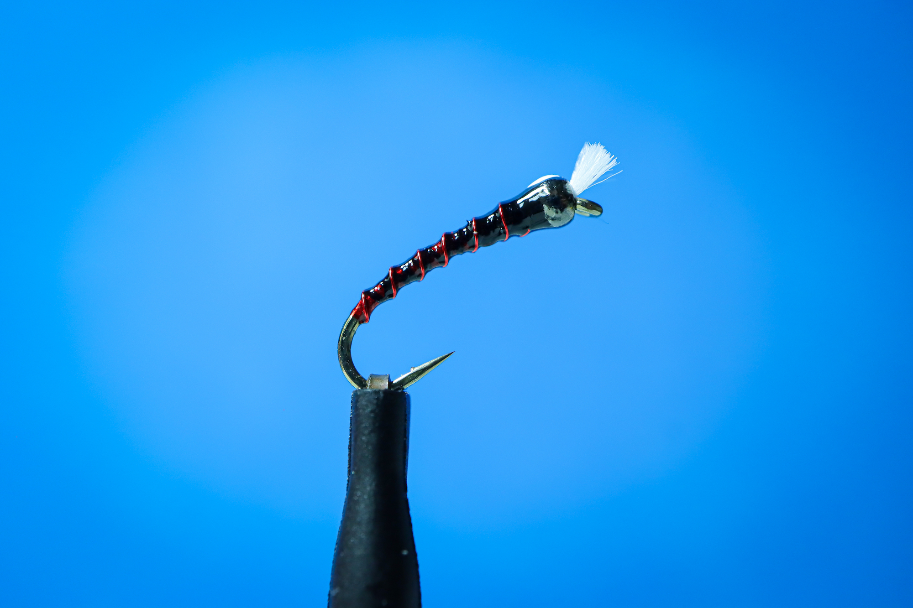

# Red Wire Chironomid

> 블랙 바디 + 레드 와이어 리빙의 클래식 커로노미드. 화이트 브리더 윙.

## 기본 정보

- **카테고리**: Chironomid
- **훅 사이즈**: #14
- **타잉 날짜**: 2026-02-06

## 재료

| 파트 | 재료 |
|------|------|
| **Hook** | 커브드 님프 훅 #14 |
| **Bead** | 글래스 비드 (클리어/스모크) |
| **Thread** | Black 8/0 |
| **Body** | Thread 빌드업 + UV Resin 코팅 |
| **Ribbing** | Red Wire (fine) |
| **Wing** | White Antron yarn (짧게 커팅) |
| **Finish** | UV Resin thin coat |

## 타잉 순서

1. 비드 넣고 훅 고정 → 쓰레드 감아 베이스 형성
2. 화이트 Antron 소량 타이인 → 브리더 윙 만들기
3. 쓰레드로 바디 쉐이핑 (벤드 쪽 가늘게 → 헤드 쪽 두껍게)
4. 레드 와이어 벤드부터 균일 간격으로 리빙
5. UV Resin 얇게 코팅 → 경화

## 메모

_리빙 간격이 바디 볼륨감을 좌우함. 와이어 장력 일정하게 유지할 것._
